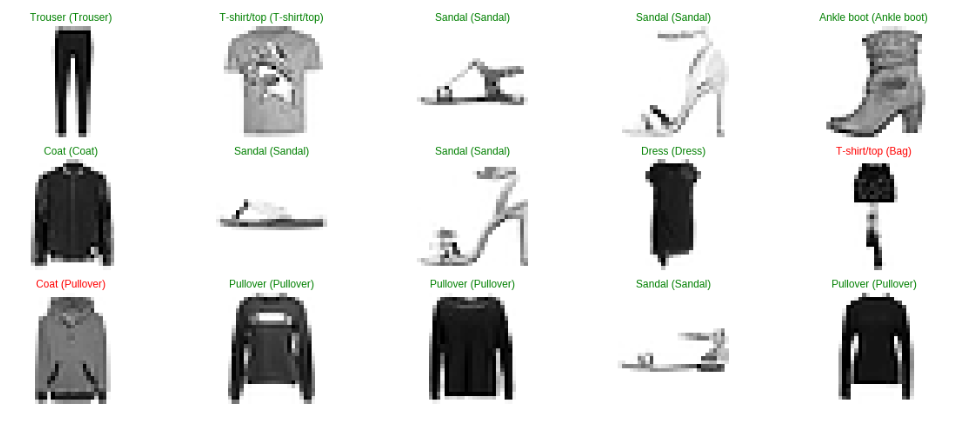

# FashionMNIST_Classifiation_GoogleCloud_TPU

# Fashion MNIST Dataset Download Link

https://www.kaggle.com/zalando-research/fashionmnist

# Installations:

- !pip install -q -U tensorflow>=1.8.0  (tensorflow)

- !pip install numpy
  
- !pip install h5py graphviz pydot
  
- !pip install keras
  
- !pip install matplotlib
  
- !pip install scikit-plot

# GoogleColab

https://colab.research.google.com/notebooks/welcome.ipynb#recent=true

*If you like this work please help me by giving me some stars.
